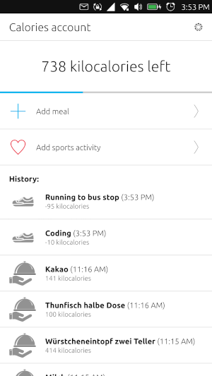
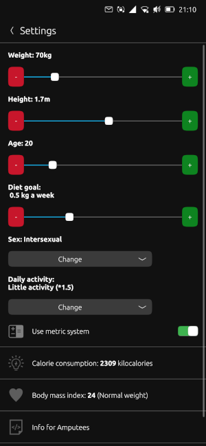

# Fastburgers


(icon by the [Numix Project](https://github.com/numixproject/numix-icon-theme-square) - GPL-3.0)

[](https://open-store.io/app/fastburgers.collaproductions)
[](https://t.me/collaproductions)

Fastburgers is a simple calorie counting app using the Harris–Benedict equation to track meals and sports activities. It is a fork of [Fatburners](https://gitlab.com/KrilleFear/fatburners) with a [dark mode patch](https://gitlab.com/KrilleFear/fatburners/-/merge_requests/7) never merged by the original author.

Additional features might be added in the future.

### Building the app (Ubuntu-based distros)

Install [clickable](https://clickable-ut.dev/en/latest/install.html):

```
$ sudo add-apt-repository ppa:bhdouglass/clickable
$ sudo apt-get install clickable
```

Clone this repository and build:

```
$ git clone https://github.com/nicolascolla/headline.git
$ cd headline
$ clickable
```

The resulting click package will be found under build/all/app.

### Screenshots

 

### TODO:

* Add weight gain mode
